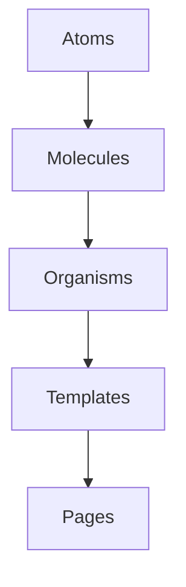

import { Meta, Intro } from "../../.storybook/components"

<Meta title="Introduction/Governance/Atomic Design" />

# Atomic Design

<Intro>
  Our design system follows Brad Frost's [Atomic
  Design](https://bradfrost.com/blog/post/atomic-web-design/) principles,
  creating a clear hierarchy for interface construction. This methodology helps
  us maintain consistency while enabling composition flexibility.
</Intro>

### Atoms

The basic building blocks of UI. Atoms are the smallest building blocks of
matter. Applied to web interfaces, atoms are our HTML tags, such as a form
label, an input or a button.

**Examples**:

- Buttons (`<Button>`)
- Input fields (`<Input>`)
- Labels (`<Label>`)
- Icons (`<Icon>`)

### Molecules

Simple component groupings. Molecules are groups of atoms bonded together and
are the smallest fundamental units of a compound. These molecules take on their
own properties and serve as the backbone of our design systems.

**Examples**:

- Search form (Input + Button)
- Form field (Label + Input + Error message)
- Card header (Title + Icon)

### Organisms

Complex UI components. Organisms are groups of molecules joined together to form
a relatively complex, distinct section of an interface.

**Examples**:

- Product card (Image + Title + Price + Add to Cart)
- Header navigation (Logo + Search + User menu)
- Data table (Filters + Column headers + Rows)

### Templates

Page structure layouts. Templates are page layouts that are used to create the
structure of a page. They are the highest level of abstraction and usually show
the skeletal framework of the design.

**Examples**:

- Blog post template (Header + Sidebar + Content area)
- Dashboard template (Nav + Main content + Widget grid)
- E-commerce product page template

### Pages

Content-filled templates using real content/data. Test performance/edge cases.

**Examples**:

- Homepage with actual article
- User profile page with live data
- Article page with real data

## Implementation Workflow

